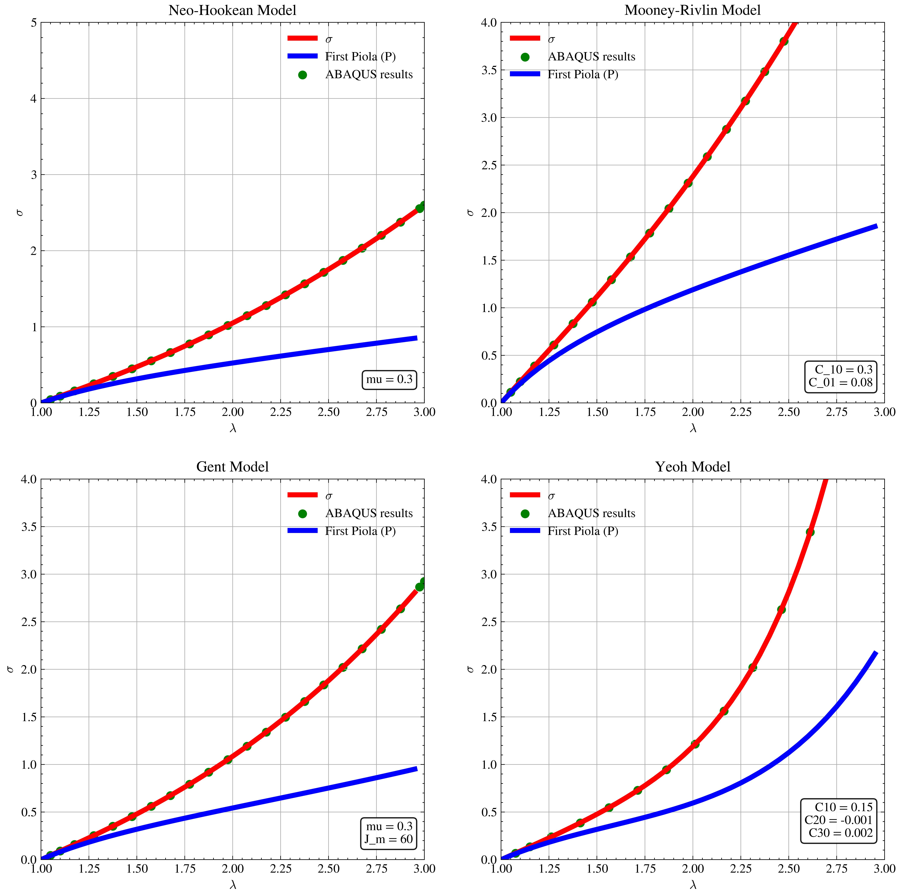

# 🏛️ The Foundations of Nonlinear Solid Mechanics

This repository presents a compact introduction to constitutive modeling for hyperelastic materials such as rubbers, soft polymers, and biological tissues. These materials can undergo large deformations, so their mechanical response must be described with nonlinear models rather than classical linear assumptions.

The code in this repository is organized around three main ideas:

- describing the kinematics of deformation,
- developing constitutive models,
- enforcing equilibrium conditions.

It provides a practical toolkit for studying hyperelastic behavior through benchmark deformation cases such as uniaxial tension and pure shear. The scripts use Python and `SymPy` to carry out symbolic calculations in a clear and reproducible way.

This repository is intended as an introductory guide for anyone who wants to explore constitutive modeling for nonlinear solids. It includes implementations of several well-known hyperelastic models, including:

- **Neo-Hookean**:

$$
W_{\mathrm{NH}} = C_{10}(I_1-3).
$$

- **Mooney–Rivlin**:

$$
W_{\mathrm{MR}} = C_{10}(I_1-3) +C_{01}(I_2-3).
$$

- **Gent**:

$$
W_{\mathrm{Gent}} = -\frac{\mu J_m}{2}\,\ln\!\left(1 - \frac{I_1 - 3}{J_m}\right)
$$

- **Yeoh**:

$$
W_{\mathrm{Yeoh}} = C_{10}(I_1-3) + C_{20}(I_1-3)^2 + C_{30}(I_1-3)^3.
$$

$$

These models are commonly used to represent the behavior of soft materials under large deformation. Before they can be used in analysis, their material parameters must be fitted to experimental data for the material of interest.

## What this repository provides

- A clear introduction to hyperelastic constitutive modeling
- Symbolic derivations for common benchmark problems
- Python-based scripts for model evaluation
- A starting point for fitting material constants to test data
- A foundation for future finite element or research applications

## Typical use cases

- studying the response of soft materials under load
- comparing different hyperelastic material models
- generating stress–stretch curves for benchmark tests
- supporting research and teaching in nonlinear mechanics

<table>
  <tr>
    <td width="100%">
      
    </td>
  </tr>
</table>

---

### 📉 Calibration

The `calibration` folder contains the standard python code for the above-mentioned material models on several benchmark experimental test.
the code Calibration.py experimental data from `test_data.txt` and jointly calibrates the hyperelastic constitutive models by fitting their nominal-stress predictions to the available datasets using nonlinear least-squares optimization. It defines the first Piola–Kirchhoff stress response for each loading mode, estimates the material parameters, and evaluates the quality of each fit using metrics such as:

- Relative root-mean-square error
- Root-mean-square error (**RMSE**)
- Normalized root-mean-square error (**NRMSE**)
- Coefficient of determination ($R^2$)
- Maximum absolute error

The fitted material constants and corresponding goodness-of-fit measures are then reported for each constitutive model.

> **Important:** Appropriate parameter bounds and initial guesses are critical for obtaining stable and physically meaningful solutions from nonlinear least-squares optimization.

---

Finally, the code generates comparison plots of the calibrated model predictions against the experimental data, saves the figures in `.svg` and `.tiff` formats, and writes a formatted summary of the calibration results to `fit_results.txt`.

---

<table>
  <tr>
    <td width="100%">
        
    </td>
  </tr>
</table>
### 🐍 Dependencies & Libraries

Regarding the Python files, the following libraries have been utilized:
* `matplotlib`
*  `scipy`

