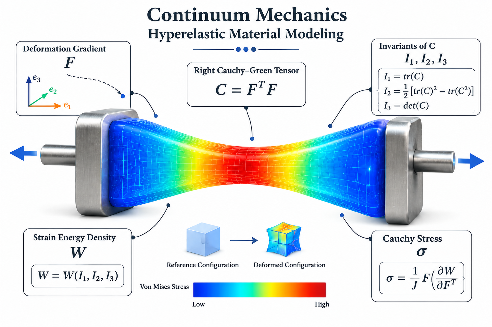
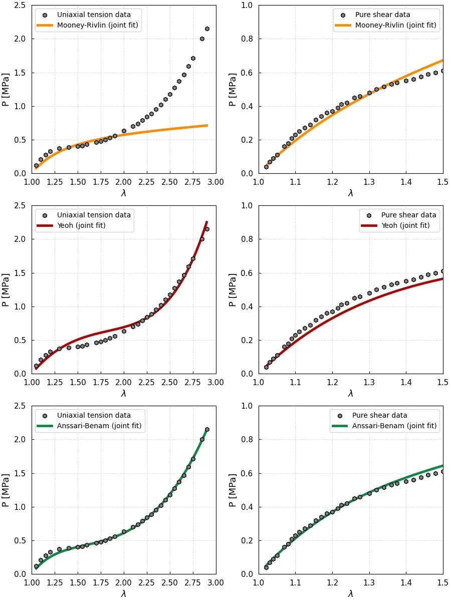

🏛️ The Foundations of Nonlinear Solid Mechanics
Constitutive modeling is the essential mathematical framework that enables us to predict how hyperelastic materials—such as rubbers, bio-tissues, and soft polymers—respond to external loads by defining a Strain Energy Density Function ($W$) 📐. Unlike linear materials, hyperelastic solids exhibit extreme geometric and material nonlinearities, often undergoing massive deformations 🌀. By accurately capturing this complex mechanical behavior, constitutive models allow engineers to perform reliable Finite Element Analysis (FEA), which is indispensable for modern engineering design 🏎️.

- kinematics of the problem,
- Constitutive model development,
- imposing the equilibrium state.

This repository serves as a useful toolkit, offering derived governing equations of hyperelastic materials using benchmark tests such as uniaxial tension and pure shear 🛠️. Within the codebase, you will quickly discover the power and convenience of the SymPy library as a versatile tool for symbolic calculations in Python 🐍. These scripts are designed to act as an introductory tutorial, providing a clear pathway to dive into the world of constitutive modeling for nonlinear solids. High-fidelity implementations of well-known models, including the Neo-Hookean, Mooney-Rivlin, and Yeoh formulations, are all developed within the code to jumpstart your research 🌐.

This repository provides comprehensive information regarding **hyperelastic materials** and their **constitutive modeling**.
Based on the available data, equations have been derived for **uniaxial tension** and **pure shear** problems. 

the **Cauchy stress tensor** are derived based on the differentiaon of the strain energy function well-defined.
well-known strain energy functions have been ontroduced in the literature, such as 
- **Neo-Hookean**
- **Mooney–Rivlin**
- **Yeoh**

The strain-energy density function of the **Neo-Hookean model** is

$$
W_{\mathrm{NH}} = C_{10}(I_1-3).
$$

The **Mooney–Rivlin model** incorporates the first and second strain invariants:

$$
W_{\mathrm{MR}} = C_{10}(I_1-3) +C_{01}(I_2-3).
$$

The third-order **Yeoh model** depends only on the first strain invariant:

$$
W_{\mathrm{Yeoh}} = C_{10}(I_1-3) + C_{20}(I_1-3)^2 + C_{30}(I_1-3)^3.
$$

Before deriving the constitutive behavior. each of these models need to be fitted on experimental data for thei material constants.

---

### 📉 Calibration

The `calibration` folder contains the standard python code for the above-mentioned material models on several benchmark experimental test.
the code Calibration.py experimental data from `test_data.txt` and jointly calibrates the hyperelastic constitutive models by fitting their nominal-stress predictions to the available datasets using nonlinear least-squares optimization. It defines the first Piola–Kirchhoff stress response for each loading mode, estimates the material parameters, and evaluates the quality of each fit using metrics such as:

- Relative root-mean-square error
- Root-mean-square error (**RMSE**)
- Normalized root-mean-square error (**NRMSE**)
- Coefficient of determination ($R^2$)
- Maximum absolute error

The fitted material constants and corresponding goodness-of-fit measures are then reported for each constitutive model.

> **Important:** Appropriate parameter bounds and initial guesses are critical for obtaining stable and physically meaningful solutions from nonlinear least-squares optimization.

---

Finally, the code generates comparison plots of the calibrated model predictions against the experimental data, saves the figures in `.svg` and `.tiff` formats, and writes a formatted summary of the calibration results to `fit_results.txt`.

---

<table>
  <tr>
    <td width="100%">
        
    </td>
  </tr>
</table>
### 🐍 Dependencies & Libraries

Regarding the Python files, the following libraries have been utilized:
* `matplotlib`
*  `scipy`

