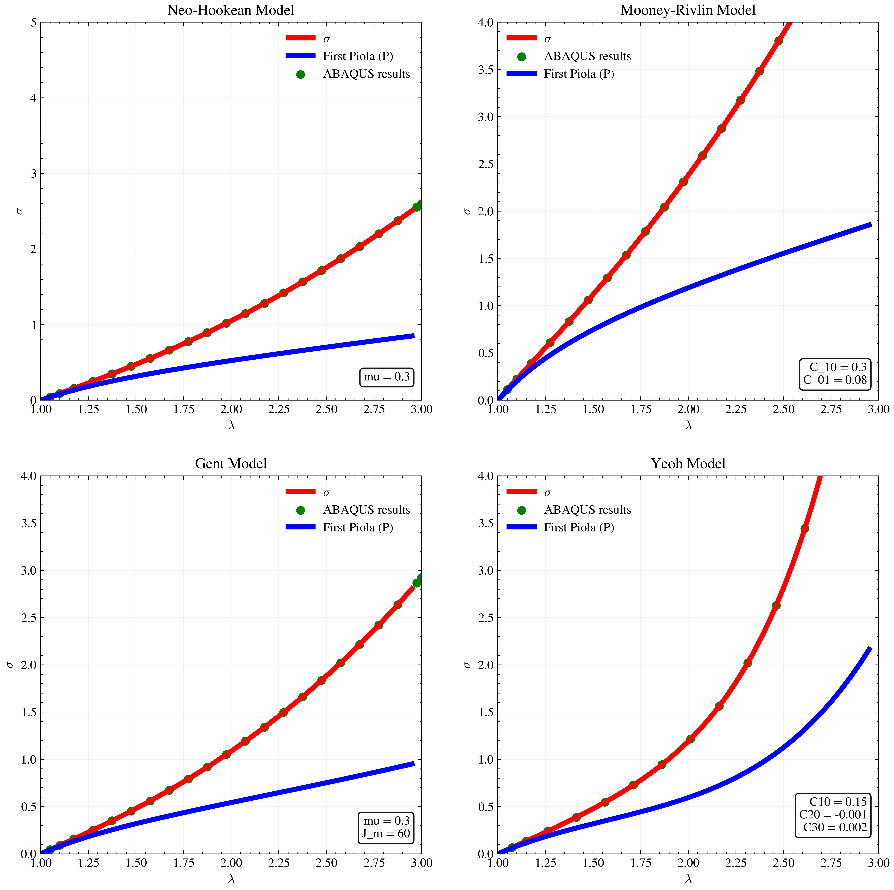

# Installation requirements

To install the required dependencies, run the following command in your terminal:

```bash
pip install matplotlib scipy sympy numpy
```


# 🏛️ The Foundations of Nonlinear Solid Mechanics

This repository presents a compact introduction to constitutive modeling for hyperelastic materials such as rubbers, soft polymers, and biological tissues. These materials can undergo large deformations, so their mechanical response must be described with nonlinear models rather than classical linear assumptions.

The code in this repository is organized around three main ideas:

- describing the kinematics of deformation,
- developing constitutive models,
- enforcing equilibrium conditions.

It provides a practical toolkit for studying hyperelastic behavior through benchmark deformation cases such as uniaxial tension and pure shear. The scripts use Python and `SymPy` to carry out symbolic calculations in a clear and reproducible way.

This repository is intended as an introductory guide for anyone who wants to explore constitutive modeling for nonlinear solids. It includes implementations of several well-known hyperelastic models, including:

- **Neo-Hookean**:


$$
W_{\mathrm{NH}} = C_{10}(I_1-3)
$$


- **Mooney–Rivlin**:


$$
W_{\mathrm{MR}} = C_{10}(I_1 - 3) + C_{01}(I_2 - 3)
$$


- **Gent**:

$$
W_{\mathrm{Gent}} = -\frac{\mu J_m}{2}\ln\left(1 - \frac{I_1 - 3}{J_m}\right)
$$

- **Yeoh**:

$$
W_{\mathrm{Yeoh}} = C_{10}(I_1-3) + C_{20}(I_1-3)^2 + C_{30}(I_1-3)^3.
$$

- **Anssari-Benam**:

$$
W(I_1, I_2) = {3\frac{n_1-1}{2n_1}} \mu_1 N_1 \left[\frac{(I_1-3)^{\beta_1}}{3N_1(n_1-1)} - \ln\left( \left( \frac{I_1-3N_1}{3-3N_1}\right)^{\beta_1} \right)\right]  + c_{20} \left[(\left(\frac{I_2}{3}\right)^{\varepsilon_1} -1\right)\right] 
$$

These models are commonly used to represent the behavior of soft materials under large deformation. Before they can be used in analysis, their material parameters must be fitted to experimental data for the material of interest.

## What this repository provides

- A clear introduction to hyperelastic constitutive modeling
- Symbolic derivations for common benchmark problems
- Python-based scripts for model evaluation
- A starting point for fitting material constants to test data
- A foundation for future finite element or research applications

## Typical use cases

- studying the response of soft materials under load
- comparing different hyperelastic material models
- generating stress–stretch curves for benchmark tests
- supporting research and teaching in nonlinear mechanics

<table>
  <tr>
    <td width="100%">
      
    </td>
  </tr>
</table>

---


# 📉 Calibration
The `calibration` folder contains a standard raw Python code as well as a Python app (more user-friendly) for fitting well-known material models (mentioned before).
The code uses experimental data for uniaxial tension and pure shear tests.


