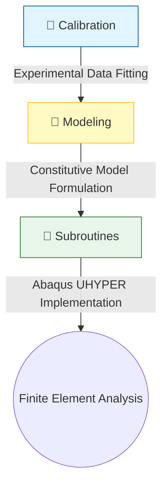

# Hyperelastic Material Modeling

This repository contains the computational framework developed for the constitutive characterization and finite element implementation of hyperelastic materials. The pipeline bridges the gap between experimental characterization and numerical simulation.

## 📂 Repository Structure

The workflow is organized into three distinct stages:

---

## 🛠 Directory Overview

### 1. 📉 Calibration
**Purpose:** Extract material parameters from experimental test data.
*   **Workflow:** This directory processes raw data from **uniaxial tension** and **pure shear** tests.
*   **Contents:**
    *   `raw_scripts/`: Standard Python scripts for rapid parameter extraction.
    *   `app/`: A user-friendly GUI tool designed for interactive model fitting and visualization of material response vs. experimental data.

### 2. 📓 Modeling
**Purpose:** Formulation and development of novel hyperelastic constitutive laws.
*   **Workflow:** These notebooks serve as the research sandbox for deriving energy density functions and testing the mathematical stability of proposed models.
*   **Contents:** Jupyter Notebooks (`.ipynb`) containing symbolic derivations, optimization routines, and theoretical validation of hyperelastic constitutive behavior.

### 3. ⚙️ Subroutines
**Purpose:** High-performance deployment of models in commercial FEM software.
*   **Workflow:** Once a model is validated in the `Modeling` stage, it is ported here for large-scale simulation.
*   **Contents:** Fortran-based `UHYPER` subroutines for Abaqus.
    *   *Note:* These subroutines utilize the strain energy potential definition to allow Abaqus to handle the internal stress and Jacobian calculations, ensuring robust convergence for incompressible/nearly-incompressible hyperelastic simulations.

---

## 🚀 How to Use This Pipeline

1.  **Characterization:** Start in `Calibration/` to process your experimental test data.
2.  **Theoretical Validation:** Use the notebooks in `Modeling/` to define your strain energy density function and evaluate the mechanical response.
3.  **Simulation:** Port your finalized energy potential into the Fortran templates found in `Subroutines/` to run your Finite Element Analysis in Abaqus.

